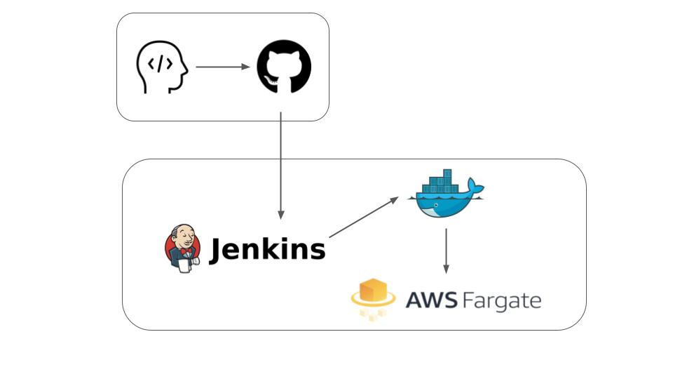

## Welcome to 19 Team GitHub Pages
**실제 코드 작성 깃 주소** : https://github.com/sheayun-kmu/capstone-fadu-2021    
**팀페이지 주소** : https://kookmin-sw.github.io/capstone-2021-19/  

## 목차  
- [프로젝트 소개](#프로젝트-소개)  
- [Abstract](#Abstract)
- [팀 소개](#팀-소개)  
- [시스템 구성도](#시스템-구성도)  
- [개발](#개발)  
  - [개발 환경](#개발-환경)  
  - [Static Analysis Status](#Static-Analysis-Status)  
  - [Code Styling Status](#Code-Styling-Status)  
- [사용법](#사용법)  
- [협업 공간](#협업-공간)  

## 프로젝트 소개  

**개발자를 위한 코드 스타일, analysis status reporter plugin**  

한 눈에 알아보기 쉬운 코드! 클린한 코드!  
필요한 코드! 예외처리가 잘 된 코드!  
그러한 코드를 위해 작성한 코드를 분석하여 더욱 쉽고 간편하게 보여주기 위해 만드는 플러그인  
팀장이 말하지 않아도 스스로 알 수 있다! 빠밤!  

## Abstract

This project aims to reporting analysis check using clang-format, IKOS.
clang-format checks coding style defined by a company or a team.
To cutomize coding style using clang-format, you can write .clang-format file.
IKOS checks useless or containing potential risk code.
After checking clang-format and IKOS, the result is connected to Jenkins warning-ng plugin.
Finally, you can see the checking result through graph.

## 소개 영상  
1. 소개 영상  
    
3. 홍보용(간단한 애니매이션 형태)  
     
5. 시연 영상  
    

## 팀 소개  
  
이름: 이은지  
StudentID: 20171674  
Role : Static Analysis Status Report  
E-mail : ji0859@kookmin.ac.kr   
Git : https://github.com/ji0859/capstone-fadu-2021  

이름: 김민정  
StudentID: 20171589  
Role : Code Styling Status Report  
E-mail : kimmj@kookmin.ac.kr  
Git : https://github.com/MinjeongKim98/capstone-fadu-2021  

## 시스템 구성도  

  

## 개발  
### 개발 환경  

1. 도커에서 개발 가능하도록 개발 환경 구축  
2. AWS의 Fargate를 이용한 쉬운 컨테이너 배포 환경 구축  

### Static Analysis Status  

[Ikos](https://github.com/NASA-SW-VnV/ikos) 를 이용하여 코드를 분석해 나온 결과를 json으로 변경해주는 translator를 만든다.  
translator의 결과를 보여주는 파서를 작성한다. 해당 파서가 보여주는 결과와 해당 결과를 가시적으로 표현하는 대시보드를 작성해서 플러그인으로 빌드한다.  

### Code Styling Status  

[Clang-Format](https://clang.llvm.org/docs/ClangFormat.html) 을 이용하여 코드를 분석해 나온 결과를 xml으로 변경해주는 translator를 만든다.  
translator의 결과를 보여주는 파서를 작성한다. 해당 파서가 보여주는 결과와 해당 결과를 가시적으로 표현하는 대시보드를 작성해서 플러그인으로 빌드한다.  

## 사용법  

1. target directory의 hpi 파일을 다운받아 Jenkins > Jenkins 관리 > 플러그인 관리 > 고급 > 플러그인 올리기에 해당 hpi을 올린다.  
2. github repository와 연결한 프로젝트에서 build의 execute shell을 이용해 clang-format / IKOS 툴을 commit한 파일에 대해 검사한다.
3. Build시 설치한 플러그인을 선택하고, 앞서 검사한 결과를 지닌 report의 이름과 형식을 적는다.  
4. 앞의 단계를 완료한 후 빌드하기를 누르면 검사한 결과에 대한 그래프와 결과를 볼 수 있다.  

## 협업 공간  

노션 : https://www.notion.so/a13b63cc11884340b6c5d57b70d62794   
일정 관리 : https://trello.com/b/sV0n4Xuf/schedule  

## 문서
중간 발표 자료: [중간발표 pdf 파일](./docs/capstone-19조_중간발표자료.pdf)  
기말 발표 자료: [기말발표 pdf 파일](./docs/19조DSP.pdf)
